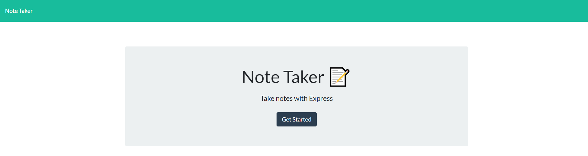
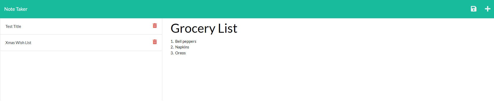

# Note Taker

## Description

This application allows users to write and save notes, as well as display stored notes back to the page. I learned how to use backend functionality through the express package to send, receive, and modify data through GET, POST, and DELETE routes; this data is stored within a JSON file functioning as a database. I also learned how to deploy an application to Heroku to preview its custom features.

## Table of Contents 

- [Installation](#installation)

- [Usage](#usage)

- [License](#license)

- [Contributing](#contributing)

- [Tests](#tests)

- [Questions](#questions)

## Installation

Before running the application, make sure you have installed the 'express' package . Navigate to the repository in the terminal and run 'npm i' to install. 

## Usage

Navigate to the repository in the terminal. Then, run 'node server.js.' The terminal will print a localhost URL that will send you to the Note Taker homepage. Enter text into the note title and note text fields, then click the save button that appears in the navigation bar at the top of the page. Clicking on an existing note repopulates the Note Title and Note Text fields with the existing note's title and text. Clicking the trash can icon next to an existing note deletes that specific note. Finally, clicking the '+' symbol in the navigation bar allows you to write a new note. 

Test this application on Heroku here: 

## License

This project is covered under the MIT license.

## Contributing

No contribution guidelines at this time.

## Tests

N/A

## Questions

Direct all questions about this application to the following sources:

Github Profile: https://github.com/agarfar

Email: antfar67@gmail.com
